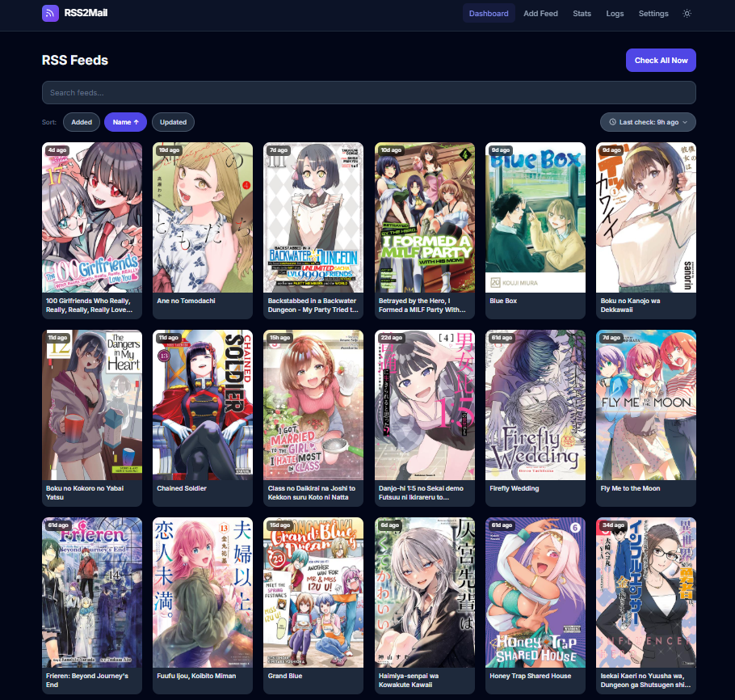

# RSS2Mail

Monitor RSS feeds and send new items via **Gmail** and/or **Facebook Messenger**.
Includes a full **WebUI** for managing feeds, settings, and logs.



---

## Features

- Monitor multiple RSS feeds on a configurable interval — works with **any standard RSS/Atom feed**, not just manga sites
- Send email digests via Gmail (SMTP)
- Send updates to Facebook Messenger
- WebUI dashboard with dark mode, feed detail panel, and sorting
- Built-in **Discover** search to find and add Weebcentral manga/manhwa series by name (optional convenience feature — you can still add any feed manually by URL)
- Docker support for easy deployment

---

## Installation

### Docker Compose (recommended)

This is the recommended way to run RSS2Mail — it builds the frontend, installs
all Python dependencies, and persists your database in a Docker volume, all in
one command.

```bash
# 1. Clone the repo
git clone https://github.com/yourname/rss2mail.git
cd rss2mail

# 2. Set up credentials
cp .env.example .env
nano .env   # fill in your Gmail and Messenger values

# 3. Build and start the container
docker compose up -d --build
```

Open **http://localhost:5000** in your browser.

To pull in updates later:

```bash
git pull
docker compose up -d --build
```

Useful day-to-day commands:

```bash
docker compose logs -f      # tail logs
docker compose restart      # restart the container
docker compose down         # stop (data in the volume is preserved)
```

> The container restarts automatically after a reboot as long as Docker itself
> is enabled: `sudo systemctl enable docker`. `restart: unless-stopped` in
> `docker-compose.yml` handles the rest — no extra systemd unit needed.

---

### Local development (without Docker)

Only needed if you're modifying the code — for normal use, prefer Docker
Compose above.

```bash
# 1. Setup (creates venv + installs deps)
./setup.sh

# 2. Set up credentials
cp .env.example .env
nano .env

# 3. Load env and launch both servers
set -a && source .env && set +a
./webui/launch.sh
```

- WebUI: http://localhost:5173
- API:   http://localhost:5000/api

---

## Environment Variables

Copy `.env.example` to `.env` and fill in your values:

| Variable | Description |
|----------|-------------|
| `RSS2MAIL_EMAIL` | Your Gmail address |
| `RSS2MAIL_APP_PASSWORD` | Gmail [App Password](https://support.google.com/accounts/answer/185833) (not your login password) |
| `RSS2MAIL_MESSENGER_TOKEN` | Facebook Page Access Token (optional) |
| `RSS2MAIL_MESSENGER_RECIPIENT_ID` | Facebook Recipient ID (optional) |

> Once you save settings via the WebUI, they are stored in the SQLite DB and env vars are no longer required on restart.

---

## CLI Usage

```bash
source venv/bin/activate

python rss2mail.py send              # Send emails for new items
python rss2mail.py add <name> <url>  # Add a feed
python rss2mail.py remove <id>       # Remove a feed
python rss2mail.py list              # List all feeds
python rss2mail.py interval <min>    # Change check interval
python rss2mail.py reset             # Reset processed items
python rss2mail.py send-messenger    # Send to Messenger only
python rss2mail.py send-all          # Send to both
```

---

## Run at Boot (Linux)

With Docker Compose, `sudo systemctl enable docker` plus `restart: unless-stopped`
in `docker-compose.yml` is all you need — see the Docker Compose section above.

Running without Docker instead? See
**[webui/README.md](webui/README.md#running-at-boot-linux--systemd)** for
systemd unit file instructions.

---

## File Structure

```
rss2mail/
├── .env.example            # Credentials template — copy to .env
├── .env                    # Your credentials (git-ignored)
├── .gitignore
├── Dockerfile
├── docker-compose.yml
├── requirements.txt
├── setup.sh                # First-time local setup
├── rss2mail.py             # CLI entry point
├── db.py                   # SQLite helpers
├── messenger.py            # Messenger module
├── config/
│   ├── credentials.py      # Reads from env vars (git-ignored)
│   └── settings.py         # Default interval
├── venv/                   # Python virtualenv (git-ignored)
├── rss2mail.db             # SQLite database (git-ignored)
└── webui/
    ├── README.md           # Full WebUI & deployment docs
    ├── launch.sh           # Dev launcher
    ├── backend/
    │   └── app.py          # FastAPI server
    └── frontend/           # React + TypeScript + Vite
```

---

## WebUI Docs

For full WebUI setup, API reference, and advanced deployment options see **[webui/README.md](webui/README.md)**.
